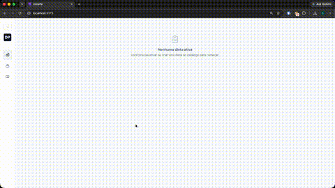

# 🥗 DietaPal

O **DietaPal** é um planejador de dietas inteligente, interativo e moderno. Projetado com uma interface estilo dashboard minimalista e monocromático (Light Mode), o aplicativo permite que você monte, ajuste e gerencie sua rotina alimentar diária com cálculos de macronutrientes precisos em tempo real e persistência imediata.



---

## ✨ Funcionalidades Principais

*   **Painel de Controle em Tempo Real**: Visualize instantaneamente o consumo acumulado de Calorias (kcal), Proteínas (g), Carboidratos (g) e Gorduras (g) comparados com suas metas diárias através de barras de progresso dinâmicas.
*   **Timeline de Refeições Interativa**: Estruture seu dia adicionando, excluindo ou renomeando refeições na hora. Utilize a função de **Duplicar Refeição** para clonar lanches repetitivos com um único clique.
*   **Tabela TACO Integrada**: Faça buscas inteligentes no catálogo padrão que conta com os alimentos mais consumidos da tabela brasileira (arroz, feijão, frango, ovos, frutas, etc.).
*   **Alimentos Personalizados**: Adicione alimentos customizados permanentes no catálogo ou insira-os diretamente em porções personalizadas nas refeições.
*   **Salvamento Automático (Autosave)**: Esqueça botões manuais de salvar. Todas as alterações são sincronizadas em tempo real com o banco de dados. Os inputs salvam de forma otimizada ao perder o foco (`onBlur`) ou ao pressionar `Enter`.
*   **Evitação de Erros de Arredondamento**: Ao alterar a quantidade de um alimento keystroke-por-keystroke, os macros são recalculados proporcionalmente a partir do macro base do alimento, impedindo a perda de precisão matemática.
*   **Importação e Exportação JSON**: Baixe suas dietas estruturadas em arquivos `.json` locais e restaure-as de forma simples na aba de catálogo.
*   **Modais Elegantes Integrados**: Substituição completa de todos os alertas (`window.alert`) e confirmações (`window.confirm`) do navegador por diálogos modais modernos.

---

## 🏗️ Arquitetura e Engenharia de Software

O ecossistema do DietaPal foi refatorado utilizando princípios de **Clean Architecture** e padrões de projeto robustos:

### Backend (Node.js + Fastify + Prisma + PostgreSQL)
*   **Repository Pattern**: O acesso ao banco de dados foi desacoplado por completo. Os contratos de repositórios ([food.repository.interface.ts](file:///Users/tosuki/Documents/Projects/diet-broker/api/src/repositories/food.repository.interface.ts) e [diet.repository.interface.ts](file:///Users/tosuki/Documents/Projects/diet-broker/api/src/repositories/diet.repository.interface.ts)) isolam as chamadas SQL da lógica da aplicação.
*   **Use Cases (Services)**: Lógicas de negócio encapsuladas em classes com responsabilidade única de execução (Ex: `list-diets.usecase.ts`, `create-custom-food.usecase.ts`), totalmente comentadas em JSDoc com exemplos de uso.
*   **HTTP Controllers**: Roteamento HTTP isolado em `src/http/controllers/` utilizando a convenção dot-notation (`dominio.tipo.ts`).

### Frontend (React 19 + Vite + TanStack Query v5)
*   **Desacoplamento de Lógica**: Componentes como `dashboard.component.jsx` focam puramente em renderizar o visual e capturar eventos. Toda a lógica de estado, formulários e chamadas assíncronas reside em **Custom Hooks** (`web/src/hooks/`).
*   **TanStack Query v5**: Utilizado para cachear consultas do servidor (`['diets']`, `['activeDiet']`, `['foods']`), tratar erros e gerenciar mutations concorrentes com invalidação inteligente de cache.

---

## 🚀 Planos Futuros e Escalabilidade

O DietaPal foi desenhado para evoluir e expandir nos seguintes pilares:

1.  **Versão Mobile (React Native / Flutter)**: Desenvolver um aplicativo móvel para que os usuários possam acompanhar, editar e registrar alimentos em trânsito no dia a dia.
2.  **Suporte nativo a MongoDB**: 
    A estrutura de dados de uma dieta (composta por arrays dinâmicos e aninhados de refeições e alimentos consumidos) é perfeitamente adequada para o modelo de **documentos do MongoDB**. Graças à implementação do **Repository Pattern** no backend:
    *   Para trocar o banco de dados de PostgreSQL (Prisma) para MongoDB, bastará criar os repositórios concretos `MongoFoodRepository` e `MongoDietRepository` implementando as mesmas interfaces e habilitá-los no ponto de injeção global de dados.
    *   Isso garantirá uma conexão de alto desempenho e latência reduzida para alimentar a futura versão mobile do DietaPal.

---

## ⚙️ Como Executar o Projeto Localmente

### Pré-requisitos
*   Docker instalado e rodando.
*   Node.js instalado (v18 ou superior).

### Passo 1: Executar o Banco de Dados
Na raiz do projeto, inicie o PostgreSQL via Docker:
```bash
docker compose up -d
```

### Passo 2: Executar o Backend (API)
Navegue até o diretório `api/`, instale as dependências, execute o seed inicial da Tabela TACO e inicie o servidor:
```bash
cd api
npm install
npx prisma generate
npx tsx prisma/seed.ts
npm run dev
```
*A API estará ativa em `http://localhost:3001`.*

### Passo 3: Executar o Frontend (Interface Web)
Navegue até o diretório `web/`, instale as dependências e execute o Vite dev server:
```bash
cd ../web
npm install
npm run dev
```
*O frontend abrirá automaticamente em `http://localhost:5173`.*
